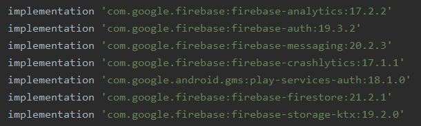

# :dog: MIAUFF :cat:

## Autores

|              Nombre              |GitHub nickname|
|----------------------------------|---------------|
|   Gabriel Eduardo Bojacá Munar   |[GabrielBojaca](https://github.com/GabrielBojaca)|
|    Andrés Felipe Forero Salas    |[fore1806](https://github.com/fore1806)|
|    Carlos Mario Jiménez Novoa    |[cajimn](https://github.com/cajimn)|
|  Allan Giordy Serrato Gutierrez  |[allangsg](https://github.com/alllangsg)|

## Introducción

Las mascotas en la actualidad son consideradas por muchas personas como parte de su familia, cada día es más común observar a estos seres en colegios, teniendo un seguro de salud, servicios funebres y un sin fin de actividades que anteriormente se encontraban reservadas para los seres humanos. Sin embargo, no se puede negar que la cuarentena en el país debida a la pandemia del COVID-19, las mascotas abandonadas y maltratadas han ido en aumento. 

Pensando en esto, Miauff es un proyecto desarrollado por estudiantes de la Universidad Nacional de Colombia para la clase de Programación Orientada a Objetos (POO) que busca permitir al usuario, mejorar la experiencia con su(s) mascota(s), y a la vez ayudar a fundaciones y estamentos gubernamentales en su labor a través de una comunidad de amantes de los animales.

## Objetivos

### Objetivo Principal

Diseñar e Implementar una aplicación empleando POO.

### Objetivos Específicos

- Desarrollar conocimiento en un nuevo lenguaje de programación.

- Aplicar los conceptos desarrollados a lo largo de la asignatura.

- Diseñar una aplicación de tipo red social para mascotas funcional.

## Implementación

Para el desarrollo de este proyecto de programación el grupo de trabajo utilizó el Entorno de Desarrollo Integrado (IDE) Android Studio y el lenguaje de programación Kotlin.

La aplicación se encuentra desarrollada a base de activities, clases que tienen por objeto la realización de pantallas, se utilizaron otros elementoss dispuestos por la IDE para el trabajo con botones, imagenes y textos. Contando actualmente con 7 activities.

Para almacenar la información de los usuarios y además permitir el registro e inicio de sesión en la aplicación se utiliza el servicio de google [Firebase](https://firebase.google.com/?authuser=4) para lo que se deben implementar diversas librerias para poder utilizar los diversos servicios de este servicio.



Para usar imágenes de tipo circulares fue necesario implementar la libreria desarrollada por el usuario [hdodenhof](https://github.com/hdodenhof) de nombre [CircleImageView](https://github.com/hdodenhof/CircleImageView)

A continuación se exponen las clases desarrolladas por el equipo de trabajo, estas clases al igual que las funciones desarrolladas por el equipo de trabajo se encuentran debidamente documentados utilizando [KDoc Syntax](https://kotlinlang.org/docs/reference/kotlin-doc.html)

### Implementación de Clases

#### Clase Abstracta ```Mascota```

```Mascota``` es una clase abstracta utilizada como padre de las clases Perro y Gato, se abstrae Mascota al contar con el método abstracto ```saveInformation()``` debido a que en las clases que heredan de ella se debe realizar este método de formas distintas, teniendo su propia información.

Los atributos de esta clase son las caracteristicas principales de una mascota, su nombre, raza, peso, sexo, fecha de nacimiento, color de pelo además de su propietario. Cuenta con el método ```savePrincipalInfo( tipoPet:String)``` que se encarga de almacenar la información suministrada en el constructor de esta clase y almacenado en sus atributos. El parámetro que se muetra permite organizar de mejor manera la base de datos de Firebase con el tipo de mascota.

#### Clase ```Perro```

```Perro``` es una clase que hereda de ```Mascota``` cuenta ademas con los atributos referentes a la vacunación de un perro. Se implementa el método abstracto ```saveInformation()``` permitiendo almacenar en la base de datos de Firebase del proyecto toda la información del perro al llamar el método ```savePrincipalInfo( tipoPet:String)``` dentro del método con el parámetro ```"Perro"```. A continuación se muestra este método.

```
    /**
     * Envia los atributos de un obbjeto de la clase perro
     * a una base de datos de Firebase.
     */
    override fun saveInformation() {
        savePrincipalInfo("Perro")
        val db = FirebaseFirestore.getInstance()

        val data = hashMapOf("moquillo" to moquillo, "moquilloFecha" to moquilloFecha, "hepatitis" to hepatitis, "hepatitisFecha" to hepatitisFecha, "parvovirosis" to parvovirosis,
            "parvovirosisFecha" to parvovirosisFecha, "leptospirosis" to leptospirosis, "leptospirosisFecha" to leptospirosisFecha, "rabia" to rabia, "rabiaFecha" to rabiaFecha)
        db.collection("vacunas").document(propietario ?: "").collection("Perro").document(nombre ?: "").set(
            data
        )
    }
```

#### Clase ```Gato```

```Gato``` es una clase que hereda de ```Mascota``` cuenta ademas con los atributos referentes a la vacunación de un gato. Se implementa el método abstracto ```saveInformation()``` permitiendo almacenar en la base de datos de Firebase del proyecto toda la información del perro al llamar el método ```savePrincipalInfo( tipoPet:String)``` dentro del método con el parámetro ```"Gato"```. A continuación se muestra este método.

```
    /**
     * Envia los atributos de un obbjeto de la clase gato
     * a una base de datos de Firebase
     */
    override fun saveInformation() {
        savePrincipalInfo("Gato")
        val db = FirebaseFirestore.getInstance()

        val data = hashMapOf("rinotraqueitis" to rinotraqueitis, "rinotraqueitisFecha" to rinotraqueitisFecha, "panleucopenia" to panleucopenia, "panleucopeniaFecha" to panleucopeniaFecha, "leucemia" to leucemia,
            "leucemiaFecha" to leucemiaFecha,"calcivirosis" to calcivirosis, "calcivirosisFecha" to calcivirosisFecha, "rabia" to rabia, "rabiaFecha" to rabiaFecha)
        db.collection("vacunas").document(propietario ?: "").collection("Gato").document(nombre ?: "").set(
            data
        )
    }
```

## Trabajo Futuro

- Mejorar el proceso de navegación entre pantallas una vez el usuario se encuentra registrado y dentro de la aplicación.

- Implementar de manera correcta una sección Home donde los usuarios puedan publicar fotos con sus mascotas asi como stories, y una sección de Chat que facilite la interacción entre usuarios.

- Lograr una alianza con veterinarias y fundaciones que permita que se puedan ofrecer sus productos para mascotas dentro de la aplicación, facilitar la adopción de mascotas, y procesos vitales para ellas como la vacunación y esterilización pudiendo hacer convocatorias de voluntarios y permitiendo la realización y conocimiento de jornadas gratuitas para estos proceso.

## Conclusiones

- Se logró dar inicio al desarrollo de una aplicación para mascotas en el lenguaje de kotlin para dispositivos Android, utilizando como base el paradigma de la programación orientada a objetos.

- Se observó que para realizar un aplicación para android tan ambiciosa como la planteada por el equipo de trabajo, se necesita mucho trabajo y conocimiento de parte de los programadores. Lo que debido al tiempo restante para la finalización del proyecto representó el mayor reto para el grupo de programadores.

- Se encontró que para desarrollar una aplicación de esta indole, se hace indispensable la realización previa de un curso sobre aplicaciones Android.

- Se adquirió experiencia en el desarrollo de proyectos de programación en grupo, encontrándose indispensable una buena comunicción de parte del equipo de trabajo y un buen uso de herramientas como [git](https://git-scm.com/) y [GitHub](https://github.com/)

- El equipo de trabajo encuentra que el avance realizado fue bueno considerando el tiempo disponible para el desarrollo de la aplicación, es consciente del gran trabajo que falta para su culminación, por lo que para continuar con el desarrollo el equipo de trabajo debe seguir con el proceso de aprendizaje sobre este tema.

- Se encontró que el desarrollar la documentación del código utilizando la sintaxis del lenguaje de programación empleado permite una mayor legibilidad del código y una mayor facilidad para los demás programadores que puedan observar el proyecto.